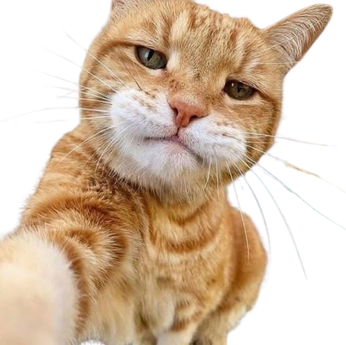

<h1 align="center">👋 Hi, I'm Zaidi Soukayna</h1>
<h2 align="center">💻 Full Stack Developer | 🧠 AI Engineer in Training | 🎓 Software Engineering Student</h2>

<h4 align="center">
I'm a 25-year-old developer from Morocco, passionate about building intelligent, data-driven, and user-focused web applications.  
I enjoy exploring new technologies, experimenting with AI models, and collaborating with others to bring creative ideas to life.
</h4>

  

---

### 🌱 Currently Learning
- Artificial Intelligence (Machine Learning, Deep Learning, NLP)
- Linux & Shell Scripting
- Scalable Backend Architectures

---

### 🚀 Featured Projects

| Project | Description | Tech Stack |
|----------|--------------|-------------|
| 🛍️ [MounaShop](https://github.com/soukayna00/MounaShop) | E-commerce platform with admin dashboard, authentication, and product management. | Laravel · MySQL |
| 💬 [Mini-Projet React](https://github.com/soukayna00/Mini_projet-React) | Dynamic front-end React project with routing and reusable components. | React · JavaScript |
| 🤖 [AI Text Summarizer (WIP)](https://github.com/soukayna00/ai-text-summarizer) | Flask-based API for generating concise text summaries using NLP. | Python · Flask · NLP |
| 🧩 [PHP Learning Repo](https://github.com/soukayna00/php-learning) | Series of exercises and mini-projects for mastering PHP fundamentals. | PHP |

---

### 🧠 Languages & Tools

  
  
  
  
  
  
  
  
  
  
  
  

---

### 📫 Connect with Me

  
  
  

---

  
  

---

  

  <b>“Code is how I express logic; creativity is how I make it human.”</b>

